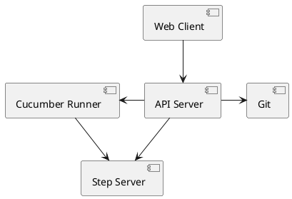

# Cukeness

## Basic Architectural Diagram




## Getting Started

Start the current version of the API Server and the Step Server.

```
docker-compose up
```

In a different terminal window start a bash session for the Runner, to test running `cucumber` with it talking to the Step Server.

```
docker-compose run runner cucumber
```

Eventually starting the Cunner is something that will be controlled by an end-point via the API Server, but for now, we're focused on getting the Step Server functional enough so that it works for our purposes.

## What We're Building

We're working on building out a server side implementation of the Cucumber Wire protocol. That will run in the `step-server` container.
